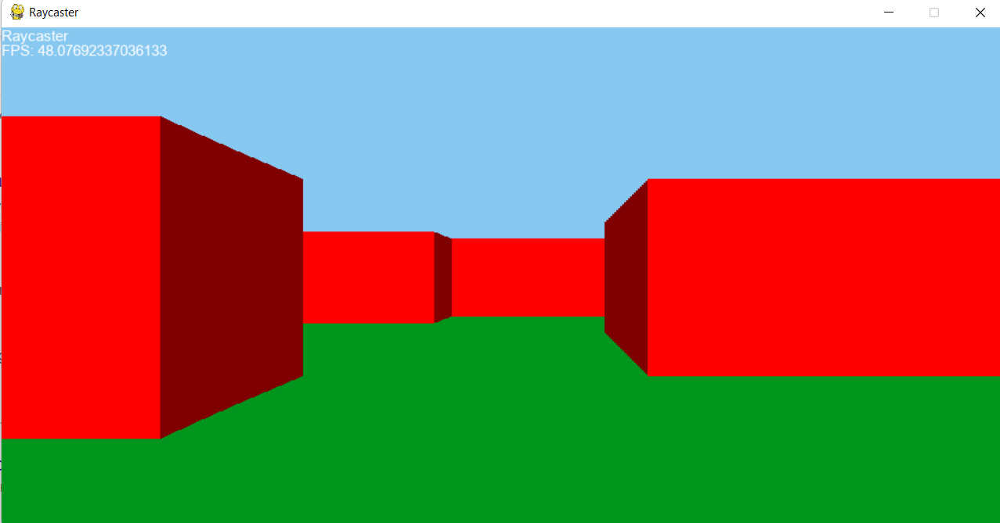

# Pygame Raycaster

Simple Raycaster made in PyGame

## Purpose
The main purpose of this project was to get my feet wet in 3D graphics programming from scratch. This was made with the help of: [this](http://www.youtube.com/watch?v=gYRrGTC7GtAs).

## Raycasting
Raycasting is useful for producing a three-dimensional perspective from a two-dimensional level layout. This is done by a simple process in which a player entity "casts" a ray. The length of the ray tells us how to render the map.

